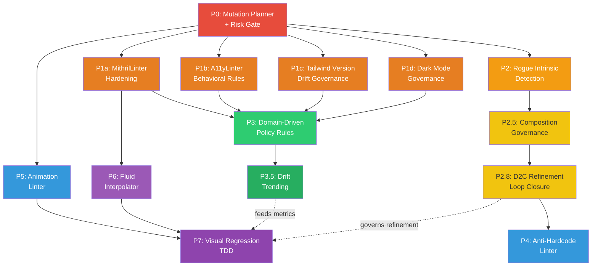

# Flint Governor Expansion Roadmap

## Strategic Vision: The "Governor over Generator" Paradigm

The ultimate goal of Flint in the Design-to-Code workflow is **not** to act as a deterministic Figma-to-HTML transpiler. Building a rigid visual-to-code compiler falls into the classic "div soup" trap, where arbitrary design tool groupings produce unmaintainable DOM structures. Every tool that has attempted this (Anima, early Builder.io, various Figma plugins) has hit the same wall: designers structure layers for design convenience, not for semantic HTML.

Instead, Flint's core value proposition relies on **Delegated Generation and Deterministic Governance**.

* **The Engine (LLMs):** We delegate to LLMs to ingest the Figma AST payload (via `read_design_intent`). LLMs excel as "semantic synthesizers"—collapsing arbitrary Figma frames into semantic, accessible HTML and writing initial state management. They understand *intent*, not just bounding boxes.
* **The Guardrails (Flint):** Flint assumes the AI will write the code, but that the code **cannot be trusted**. Flint serves as the deterministic Type Checker for Design Systems—auditing the LLM's output for layout drift, brand violations, and accessibility failures, and injecting immediate AST mutations to secure compliance.

---

## Priority Framework

Each initiative is ranked by two axes:

| Factor | Weight | Description |
|--------|--------|-------------|
| **Immediate ROI** | High | Does this catch the most common LLM failure modes today? |
| **Structural Feasibility** | High | Can this be built with modules that already exist in `flint-mcp/src/core`? |
| **Differentiation** | Medium | Does this create capability no other tool offers? |
| **Dependency Chain** | Ordering | Does this block or enable other initiatives? |

**Priority Tiers:**
- **P0** — Must-build foundation. Other initiatives depend on this.
- **P1** — High-frequency, high-ROI hardening of existing modules.
- **P2** — Structural expansion into new governance domains.
- **P3** — Policy-layer sophistication.
- **P4–P7** — Bleeding-edge, high-differentiation capabilities.

---

## Phase 1: Core Governor Expansion

### [P0] Closed-Loop Auto-Fix Remediation

**Why P0:** This is the foundational architecture. Every other initiative produces *violations*; this initiative determines what happens *after* a violation is found. Without this, Flint is a passive reporter. With it, Flint becomes an active enforcer.

**Current State:** `elicitRemediation.ts` already presents Fix Now / Preview / Skip dialogs via MCP elicitation. `fix.ts` already performs color, typography, and spacing drift fixes through Babel AST mutation. The a11y fixer (`a11y/fixer.ts`) applies `updateProp` mutations for fixable accessibility violations.

**What's Missing:** The current fix pipeline treats all violations uniformly. There is no triage layer that separates "deterministic errors" (which Flint can fix silently) from "semantic errors" (which require LLM re-prompting).

**Action Items:**
- [ ] Build a **Mutation Planner** service that classifies each violation into one of two buckets:
  - **Deterministic:** Token swap (`bg-[#F00]` → `bg-[var(--color-error-500)]`), missing `aria-label`, rogue intrinsic element swap. These can be auto-patched via AST mutation without human or LLM input.
  - **Semantic:** Missing `aria-pressed` state logic, incorrect heading hierarchy that depends on page context, component composition decisions. These must be returned to the agent as structured error payloads.
- [ ] Modify the `handleFlintFix` pipeline in `fix.ts` to consume the Mutation Planner's output, auto-applying deterministic fixes and returning semantic errors as a structured `SemanticErrorPayload[]`.
- [ ] Update the `elicitRemediation.ts` flow to report the split: "Fixed 4 violations automatically. 2 semantic issues require your attention: [...]".
- [ ] **Gate high-risk auto-fixes through `riskScoringService.ts`.** Before the Mutation Planner silently applies any deterministic fix, call `scoreMutation()` with the proposed operation. Any fix scoring above 50 (medium/high MRS tier) — such as a P2 rogue intrinsic swap (`<button>` → `<Button>`, which is a structural `wrapNode`/`deleteNode + insertNode` at MRS weight 0.45–0.65) — must be routed through the elicitation flow for human confirmation rather than applied silently. This prevents the Governor from creating unreviewed structural changes in high-sensitivity files.

**Affected Modules:** `fix.ts`, `elicitRemediation.ts`, new `mutationPlanner.ts`, `governance/riskScoringService.ts`

---

### [P1] Deepening Existing Governance

**Why P1:** These are the highest-frequency LLM failure modes. Hardening the linters that agents trigger on every single audit provides immediate, compounding value.

**Current State:** `MithrilLinter.ts` (1349 lines) runs 6 visitors: color, typography, spacing, shadows, opacity, inline styles. `A11yLinter.ts` delegates to a modular rule runner with 9 rule modules (50 rules total across names-labels, keyboard, structure, ARIA, landmarks, contrast, forms, live-regions, motion).

#### P1a: Visual & Drift Governance (`MithrilLinter.ts`)

**What's Missing:** The linter checks if a Tailwind arbitrary value *exists* in the token set but doesn't cross-reference against Figma layout constraints. For example, the Figma payload says a button has `padding: 8px 16px`, but the LLM outputs `p-3` (12px uniform). Both are valid Tailwind, but the latter is a layout drift violation.

**Action Items:**
- [ ] Add a **Figma-Constraint Cross-Reference** pass. Accept the Figma AST payload as optional context in `auditAll()`. When present, compare rendered spacing/sizing values against the Figma bounding box constraints.
- [ ] Enhance CIEDE2000 checking to auto-calculate the closest *compliant* token when a color fails WCAG contrast. Currently `findClosestToken` finds the nearest by perceptual distance, but doesn't factor in whether the *resulting pair* passes WCAG AA contrast ratios.

**Affected Modules:** `MithrilLinter.ts`, `colorMath.ts`

#### P1b: Accessibility Governance (`A11yLinter.ts`)

**What's Missing:** The 50 rules cover attribute presence (ARIA, labels, roles) and structural checks, but don't deeply analyze *behavioral* anti-patterns in the AST.

**Action Items:**
- [ ] **Interactive Anti-Pattern Detection:** Add an AST rule that flags `<div onClick={...}>` or `<span onClick={...}>` where a non-interactive element has an event handler without `role="button"` and `tabIndex`. The fixer should mutate `<div>` → `<button>` or inject role + tabIndex + onKeyDown.
- [ ] **Component-Aware Structural Requirements:** Tie `componentClassification.ts` classifications to mandatory AST structures. If a component is classified as `'dialog'` (modal), enforce the presence of focus-trapping logic (e.g., `useFocusTrap`, `FocusTrap` wrapper, or `aria-modal="true"` + focus management).

**Affected Modules:** `a11y/rules/keyboard.ts`, `a11y/rules/structure.ts`, `componentClassification.ts`

#### P1c: Tailwind Version Drift Governance (`tailwindMigrator.ts`)

**Why This Matters:** An LLM generating Tailwind classes has no inherent understanding of whether the project uses v3 or v4. It will freely mix deprecated v3 utilities (`flex-grow`, `bg-opacity-50`, `bg-gradient-to-r`) with v4-idiomatic code. The result is a component that renders correctly in a v3 project but is silently broken when the project upgrades — or vice versa. This is an invisible compliance failure, worse than a visible violation because it passes all existing linter checks.

**Current State:** `tailwindMigrator.ts` (445 lines) is a complete Tailwind v3 → v4 migration engine. It handles class renames, opacity modifier changes (`bg-opacity-50` → `bg-color/50`), ring-offset rewrites, and gradient utility renames — all via Babel AST, never regex. `TW_V3_TO_V4_MAP` is a 100+ entry transformation map covering every officially deprecated v3 utility. But this module is **not wired into the audit pipeline at all**. `MithrilLinter.ts` has no awareness of it, and no audit tool currently flags version drift.

**What's Missing:** A linter visitor that reads the project's Tailwind version from `package.json` and flags mismatched utilities as violations — then wires `TW_V3_TO_V4_MAP` as the auto-fix.

**Action Items:**
- [ ] Build a **Tailwind Version Resolver** utility (`tailwindVersionResolver.ts`) that reads `package.json` (or `package-lock.json`) to determine the installed Tailwind version (`3.x` vs `4.x`).
- [ ] Add a new `MithrilLinter` visitor (`checkTailwindVersion`) that iterates className strings, checks each token against `TW_V3_TO_V4_MAP`, and flags any deprecated-in-target-version class as `MITHRIL-TW-001` (version drift violation).
- [ ] Wire `MITHRIL-TW-001` into the P0 Mutation Planner as **deterministic** — the fix is a direct map lookup. `flex-grow` → `grow`. `bg-opacity-50` → `bg-color/50`. No semantic judgment required.
- [ ] Handle the opacity modifier edge case: `bg-opacity-50` cannot be fixed in isolation — Flint must find the sibling color class (`bg-blue-500`) and merge them into `bg-blue-500/50`. The visitor must look at the full className string, not individual tokens, for opacity modifier violations.
- [ ] Expose as a configurable policy: `mithril.tailwindVersionCheck: 'off' | 'warn' | 'error'`.

**Affected Modules:** `MithrilLinter.ts` (new visitor), `tailwindMigrator.ts` (existing, now integrated), new `tailwindVersionResolver.ts`, `policyEngine.ts` (new rule ID `MITHRIL-TW-001`)

#### P1d: Dark Mode & Theming Governance

**Why This Matters:** The entire current roadmap governs colors in light mode only. Every serious design system ships a dark mode token set, but an LLM generating `text-gray-900 bg-white` produces a perfectly compliant *light mode component* that is completely broken in dark mode. This is the most visually obvious sign of AI-generated UI that hasn't been fully governed — any user who switches their OS to dark mode will immediately see it.

**Current State:** `MithrilLinter.ts` uses CIEDE2000 to validate colors against tokens, but the check is unconditional — it doesn't know whether a color is being applied in a light or dark context. There are no `dark:` variant checks anywhere in the linter pipeline. Design tokens support semantic naming (e.g., `color/surface/background`) but there's no enforcement that components use semantic tokens instead of hardcoded light-mode primitives.

**What's Missing:** A visitor that detects light-mode-only hardcoded color usage and verifies that dark mode counterparts exist via either `dark:` Tailwind variants or semantic design tokens that auto-flip.

**Action Items:**
- [ ] Build a **Dark Mode Safety Checker** as a new `MithrilLinter` visitor. For each detected color utility (background, text, border), check if:
  1. The token it resolves to is a **semantic token** (e.g., `color/surface/background`) that has both a light and dark value defined in the token set — if so, it's safe.
  2. It is a **primitive hardcoded token** (e.g., `color/gray/900`) without a `dark:` sibling class — flag as `MITHRIL-DARK-001` (Dark Mode Safety Violation).
- [ ] Extend the design token schema to support a `modes` field per token:
  ```json
  { "token_path": "color/surface/background", "token_value": "#FFFFFF", "modes": { "dark": "#0F0F0F" } }
  ```
- [ ] The P0 Mutation Planner classifies MITHRIL-DARK-001 as **deterministic** when a semantic token with a dark-mode value exists: swap `bg-gray-900` → `bg-[var(--color-surface-background)]`. Classify as **semantic** when no semantic alternative exists (requires the LLM to add `dark:` variants).
- [ ] Add a `requiresDarkMode` flag to `policy.json` that makes this check blocking vs. advisory depending on the project's dark mode support status.

**Affected Modules:** `MithrilLinter.ts` (new visitor), `types.ts` (extended token schema), `policyEngine.ts` (new rule ID `MITHRIL-DARK-001`), `design-tokens.json` (schema update)

---

### [P2] Enforcing Design System Adoption

**Why P2:** The single most impactful governance capability for enterprise customers. Prevents the LLM from building bespoke raw HTML components when the design system already provides equivalents.

**Current State:** `registryService.ts` supports text-search and deterministic Figma-ID lookup (`queryByFigmaId`). `componentClassification.ts` maps Figma node names to UI types like `button`, `input`, `dialog`. But there is no enforcement pass that flags rogue intrinsic HTML elements in generated code.

**What's Missing:** If the LLM outputs `<button className="bg-blue-500 px-4 py-2">Submit</button>` but the registry defines a `Button` component at `@/components/ui/button`, no violation is currently raised. The rogue `<button>` passes all existing checks.

**Action Items:**
- [ ] Build a **Rogue Intrinsic Detector** as a new MithrilLinter visitor. Traverse all JSX elements. For each intrinsic element (`<button>`, `<input>`, `<table>`, `<select>`), query the `registryService` for a matching design system component.
- [ ] When a match is found, raise a new violation type `MITHRIL-REG-001` (Registry Adoption Violation) with severity configurable via `policyEngine.ts`.
- [ ] Wire the violation into the P0 Mutation Planner as a **deterministic fix**: auto-generate the `import` statement and swap the JSX element + props mapping via `ast-modifier.ts`.
- [ ] Handle prop translation: `<button disabled>` → `<Button isDisabled>` (using the `PropDefinition` metadata from `ComponentEntry`).

**Affected Modules:** `MithrilLinter.ts` (new visitor), `registryService.ts`, `ast-modifier.ts`, `policyEngine.ts` (new rule ID)

---

### [P3] Granular Design Intent Policies

**Why P3:** Provides the configurability layer that makes P1 and P2 useful across different teams and industries within the same organization.

**Current State:** `policyEngine.ts` (761 lines) is already sophisticated—v1/v2 migration, team overlays, per-rule mode maps, domain-aware resolution. Industry domains (`healthcare.ts`, `fintech.ts`, `ecommerce.ts`) exist but are not deeply integrated with the linter visitors.

**Action Items:**
- [ ] **Domain-Driven Rule Escalation:** When `policy.domain === 'healthcare'`, automatically escalate `a11y.level` to `'AAA'` and set `mithril.deltaE_threshold` to a tighter value (e.g., 1.5). When `'fintech'`, enforce minimum touch-target sizes via a new spacing rule.
- [ ] **Typography Hierarchy Enforcement:** Add a new MithrilLinter visitor that validates heading order (`h1` → `h2` → `h3`, no skipping) within a component's JSX tree. Flag disconnected headings as `MITHRIL-TYP-HIERARCHY`.
- [ ] **Team-Specific Registry Overlays:** Allow team overlays in `policy.json` to specify additional registry entries or override import paths, so different teams can enforce different component libraries within the same monorepo.

**Affected Modules:** `policyEngine.ts`, `domains/*.ts`, `MithrilLinter.ts` (new visitor)

---

### [P2.5] Composition & Slot Governance

**Why P2.5:** This is the natural continuation of P2's design system adoption story. Once you enforce "use `<Button>` not `<button>`," the immediate next question is "is that `<Button>` being *used correctly*?" LLMs don't just hallucinate individual components — they hallucinate entire compositions, nesting a `<Card>` inside a `<Button>` or placing an `<Avatar>` inside a `<Badge>` in ways that violate the design system's structural contracts.

**Current State:** `registryService.ts` already defines `ComponentEntry` with two composition-related fields:
```typescript
// registryService.ts — ComponentEntry
compositionNotes?: string;    // Human-authored composition guidance
relatedComponents?: string[]; // e.g., ["DialogHeader", "DialogFooter"] for "Dialog"
```
These are purely informational — they populate the Shadow Storybook markdown output for LLM context, but **no linter enforces them**. The scoring engine (`scoreComponent`) even indexes `compositionNotes` and `relatedComponents` for search relevance, proving the data is already valued in the system.

**What's Missing:** A structural enforcement layer that traverses the JSX AST depth-first and validates parent-child component relationships against a declarative ruleset.

**Action Items:**
- [ ] Extend `ComponentEntry` in `registryService.ts` with a new `compositionRules` field:
  ```typescript
  compositionRules?: {
      allowedChildren?: string[];    // Whitelist: only these components can be nested inside
      forbiddenChildren?: string[];  // Blacklist: these components must never be nested inside
      requiredParent?: string;       // This component must always appear inside this parent
      maxDepth?: number;             // Maximum nesting depth (e.g., Tabs inside Tabs = violation)
  }
  ```
- [ ] Build a **Composition Validator** (`compositionValidator.ts`) as a Babel AST traversal pass. Walk JSXElement nodes depth-first, maintaining a parent stack. At each component node, resolve it against the registry and check `compositionRules`. Flag violations as `MITHRIL-COMP-001`.
- [ ] Wire `MITHRIL-COMP-001` into `policyEngine.ts` — add to `KNOWN_MITHRIL_RULES` set, support per-rule mode overrides (`blocking` / `advisory` / `off`).
- [ ] Classify composition violations in the P0 Mutation Planner as **semantic** — Flint can identify *what's wrong* (Card inside Button) but cannot deterministically fix it because the correct restructuring depends on the developer's layout intent.
- [ ] Seed initial composition rules for common design system patterns:
  - `Button.forbiddenChildren = ['Card', 'Table', 'Dialog', 'Tabs']`
  - `DialogFooter.requiredParent = 'Dialog'`
  - `TabPanel.requiredParent = 'Tabs'`

**Affected Modules:** `registryService.ts` (schema), new `compositionValidator.ts`, `MithrilLinter.ts` (new visitor integration), `policyEngine.ts` (new rule ID), `flint-manifest.json` (schema update)

---

### [P3.5] Governance Telemetry & Drift Trending

**Why P3.5:** Flint audits are point-in-time snapshots. An enterprise team runs an audit, sees 12 violations, fixes them, and moves on. But nobody can answer: "Are we getting *better* or *worse* at design system compliance over time?" This is the "prove your value" layer that makes Flint a platform, not just a linter.

**Current State:** The `governance/` directory (17 services, 230KB+) already has the raw infrastructure:

| Service | What It Stores | Key API |
|---------|---------------|---------|
| `mutationLedgerService.ts` | Every AST mutation with `before_snapshot` / `after_snapshot`, source (`ai_orchestrator`, `auto_fix`, `user_action`), `operation_type`, and timestamps | `getMutationCountsByType(since)`, `getMutationCountsByFile(since, limit)` |
| `anomalyDetectionService.ts` | 3-sigma statistical anomaly detection across 5 anomaly types: `override_spike`, `violation_surge`, `velocity_spike`, `risk_drift`, `agent_behavior_change` | `computeBaseline(projectRoot, windowDays)`, `detectAnomalies(projectRoot, baseline)` |
| `riskScoringService.ts` | Per-mutation risk scores (MRS) stored in `mutation_risk_scores` table | Scoring by operation type, source trust, and historical patterns |
| `overrideTelemetryService.ts` | Tracks when governance rules are deliberately overridden, with justification | Override counts by rule, by team |

**What's Missing:** An **aggregation and trending layer** that sits on top of these services and computes longitudinal metrics. The mutation ledger can tell you "42 fixToken operations happened today," but cannot tell you "fixToken operations are up 300% from last sprint, concentrated in the `checkout/` directory."

**Action Items:**
- [ ] Build `governance/driftTrendService.ts` — a new service that consumes the mutation ledger and anomaly history to compute:
  - **Weekly/Sprint Violation Counts:** Total violations per week, broken down by rule ID (`MITHRIL-COL`, `A11Y-007`, etc.)
  - **Fix Rate:** Ratio of `auto_fix` source mutations to total violations (measures how much of the Governor is self-healing via P0)
  - **Repeat Offender Components:** Files or components that appear in the mutation ledger more than N times in a window (signals systemic design system misuse)
  - **Adoption Score:** Percentage of JSX components in the project that match the registry vs. rogue intrinsics (requires P2)
- [ ] Expose as an MCP resource at `flint://governance/trends` with a configurable window (default: 30 days). The resource payload should be a structured JSON object consumable by both LLM agents and the Glass dashboard.
- [ ] Build a **Drift Alert** mechanism: when `driftTrendService` detects that any metric exceeds a configurable threshold (e.g., "color violations increased >40% sprint-over-sprint"), emit a governance event via `eventService.ts` that surfaces in the Glass dashboard and in the next `audit_ui_component` response.
- [ ] Integrate with `anomalyDetectionService.ts` — use its existing `computeBaseline()` and `detectAnomalies()` methods as the statistical backbone, extending the anomaly types to include `drift_regression` (when a previously-clean project starts accumulating violations again).
- [ ] Add a Glass dashboard panel that renders the trend data as a time-series chart (violations over time, fix rate over time, adoption score over time).

**Affected Modules:** New `governance/driftTrendService.ts`, `governance/anomalyDetectionService.ts` (new anomaly type), `governance/eventService.ts` (new event type), `server.ts` (new MCP resource), Glass dashboard

---

### [P2.8] Closing the D2C Refinement Loop

**Why P2.8:** This is the most dangerous ungoverned step in the entire pipeline. `d2cRefinement.ts` runs an LLM (Sonnet) to improve the Figma→JSX scaffold, validating output via Babel parse before accepting it. But the Babel parse gate only checks *syntax* — it has zero awareness of design system compliance, accessibility, or token drift. The AI refinement pass is the only place in the pipeline where an LLM generates code that is **not subsequently audited**. It is treated as a trusted terminal step when it is structurally the riskiest one.

**Current State:** `d2cRefinement.ts` runs two AI calls:
- **Phase 1 (`classifyWithAI`):** Haiku model classifies Figma nodes to improve heuristic accuracy. Returns a `Map<nodeId, componentType>`. Its output is structural metadata, not code — lower risk.
- **Phase 2 (`refineComponent`):** Sonnet model receives the deterministic scaffold + Figma subtree + optional screenshot and rewrites the component for library-idiomatic quality. Output is validated via Babel parse only. Refinement is currently a terminal step — its output flows directly into the generated artifact.

**What's Missing:** After `refineComponent()` produces output, it never re-enters the Mithril/A11y audit pipeline. If the LLM refinement introduces `bg-[#FF0000]` instead of a design token, `flex-grow` instead of `grow`, or a `<div onClick>` without a role — those violations are invisible.

**Action Items:**
- [ ] After `refineComponent()` returns a `'refined'` status result, automatically pipe the refined code through `auditAll()` (MithrilLinter + A11yLinter) before the result is accepted.
- [ ] If the audit returns violations, apply the P0 Mutation Planner to them: deterministic violations are auto-fixed inline, semantic violations are surfaced as warnings in the `RefinementResult` (add a `governanceWarnings` field).
- [ ] If the refined code introduces **more** violations than the original scaffold, fall back to the scaffold (`status: 'fallback'`, `reason: 'refinement degraded governance compliance'`). This prevents LLM "helpfulness" from actively degrading a compliant scaffold.
- [ ] Score the entire refinement operation via `scoreMutation()` — a `refineComponent` call that touches many nodes at once is effectively an `assembleLayout` operation (MRS op weight: 0.7) and should be recorded in the mutation ledger with `source: 'ai_orchestrator'`, `operation_type: 'assembleLayout'`.
- [ ] Add a `governanceScore` field to `RefinementResult` reporting the audit result summary: `{ violations: number, autoFixed: number, semanticWarnings: number }`.

**Affected Modules:** `d2cRefinement.ts`, `MithrilLinter.ts`, `A11yLinter.ts`, new `mutationPlanner.ts` (P0), `governance/mutationLedgerService.ts`, `governance/riskScoringService.ts`

---

## Phase 2: New Governance Domains

### [P4] The "Anti-Hardcode Linter" (Data Hydration Governance)

**Why This Matters:** This is a uniquely AI-native problem. When an LLM generates a component from a Figma screenshot or AST, it notoriously bakes the designer's dummy text ("John Doe", "$99.99", "Lorem ipsum") into hardcoded React strings instead of parameterizing them as props or data bindings.

**Current State:** No module addresses this. The `figmaJsxTransformer.ts` (72KB) transforms Figma structures to JSX but doesn't flag hardcoded placeholder text.

**Action Items:**
- [ ] Build a **Hydration Violation Detector** that cross-references JSX string literals against the Figma AST payload. If a Figma text layer is named with a data-binding hint (e.g., `#UserData.Name`, `{{product.price}}`, or any `#`/`{{` prefix convention), but the generated JSX contains the literal placeholder string, raise a `HYDRATION-001` violation.
- [ ] The Mutation Planner (P0) classifies this as **semantic** — Flint can't know the correct prop name, but it can tell the LLM: "This text node appears to be dynamic data. Extract it as a component prop."
- [ ] Establish a naming convention for Figma layers that signal "this is data, not decoration" (e.g., `#` prefix). Document in the Figma plugin UI.

**Affected Modules:** New `hydrationLinter.ts`, `figmaJsxTransformer.ts`, Figma plugin `ui.html` (docs)

---

### [P5] Behavioral & Motion Governance (`AnimationLinter.ts`)

**Why This Matters:** We govern pixels but not physics. An LLM might slap on `transition-all duration-200 ease-linear`, completely ignoring the brand's carefully curated motion language. Inconsistent motion makes a product feel "off" even when the layout is pixel-perfect.

**Current State:** `a11y/rules/motion.ts` exists but focuses on `prefers-reduced-motion` compliance, not brand-level motion consistency.

**Action Items:**
- [ ] Define a new token type `motion` in the design token schema, capturing `duration`, `easing` (cubic-bezier), and `property` for each named transition (e.g., `transition/interactive`, `transition/page`).
- [ ] Extract prototype interaction timings and easing curves from Figma (requires Figma plugin `code.ts` expansion to read prototype connections).
- [ ] Build `AnimationLinter.ts` — an AST visitor that identifies `transition-*`, `duration-*`, `ease-*` Tailwind classes and inline `transition` / `animation` CSS properties. Flag non-token values as `MOTION-001` violations.
- [ ] Wire into the P0 Mutation Planner as **deterministic** — swap `ease-linear` → `ease-[cubic-bezier(0.87,0,0.13,1)]`.

**Affected Modules:** New `AnimationLinter.ts`, `types.ts` (new token type), `figma-plugin/code.ts`

---

### [P6] The "Fluid Interpolator" (Breakpoint Governance)

**Why This Matters:** Designers design in fixed, static frames (Mobile: 375px, Desktop: 1440px). LLMs translate this into hard breakpoints (`sm:p-4 lg:p-8`). But real screens stretch fluidly between those values, often producing awkward intermediate states.

**Current State:** `layoutAnalyzer.ts` exists but focuses on classifying Figma auto-layout structures, not on responsive breakpoint interpolation.

**Action Items:**
- [ ] Expand the Figma plugin payload to include **multiple frame variants** of the same component (Mobile, Tablet, Desktop) when they exist as Figma variants or are explicitly selected.
- [ ] Build a **Fluid Interpolation Pass** that identifies when a component has 2+ breakpoint-specific Tailwind values for the same property (e.g., `text-base lg:text-xl`). Calculate the mathematical `clamp()` function that provides fluid scaling: `text-[clamp(1rem, 0.5rem + 1.5vw, 1.25rem)]`.
- [ ] Expose as an **advisory** suggestion (not a blocking violation by default) — fluid typography and spacing are a progressive enhancement, not a hard requirement.

**Affected Modules:** `figma-plugin/code.ts`, new `fluidInterpolator.ts`, `layoutAnalyzer.ts`

---

### [P7] Visual Regression Driving AST Mutation (Layout TDD)

**Why This Matters:** AST-level analysis has a fundamental blind spot: CSS is context-dependent. A `<div>` with correct Tailwind classes can still visually break due to flex shrinking, overflow clipping, or cascading font-size inheritance. No amount of string-matching can catch "it looks wrong."

**Current State:** Flint Glass already runs Electron with a `LivePreview iframe` for visual component rendering. The `XYCanvas.tsx` infinite canvas provides the rendering surface.

**Action Items:**
- [ ] Build a **Headless Visual Auditor** that compiles a governed `.tsx` component in-memory and renders it in a headless Chromium context (via Electron's `BrowserWindow` with `show: false`).
- [ ] Measure the rendered bounding boxes of each `data-flint-id`-tagged element using `getBoundingClientRect()`.
- [ ] Compare rendered dimensions against the Figma AST bounding boxes. If any element diverges by >2px, emit a `VISUAL-REG-001` violation with the measured vs. expected dimensions.
- [ ] Feed visual failures back into the Mutation Planner to suggest CSS fixes (e.g., inject `flex-shrink-0`, `overflow-hidden`, `min-w-0`).
- [ ] **Important:** This is Glass-only (requires Electron). The MCP headless server would need a separate rendering strategy (e.g., Puppeteer) or would flag this as "run in Glass for visual validation."

**Affected Modules:** New `visualAuditor.ts` (Glass-side), `electron/` IPC additions, new `VISUAL-REG` rule type

---

## Priority Sequence & Dependency Map



**Reading the graph:** P0 (Mutation Planner + Risk Gate) is the critical dependency — everything flows from it. P1a/P1b/P1c/P1d all execute in parallel once P0 lands, hardening the core linting surface before structural work begins. P2 (Rogue Intrinsic Detection) runs in parallel with P1 since its infrastructure is 80% in place. P2.5 (Composition) follows P2, and P2.8 (D2C Refinement Loop) follows P2.5 since it needs the full audit pipeline — including composition governance — to be complete before closing the refinement loop meaningfully. P4 (Anti-Hardcode) follows P2.8 since both operate on the same D2C output surface. P7 (Visual Regression) is the capstone.

---

## Priority Order Rationale

**The ordering holds, with four specific notes:**

1. **P2 (Rogue Intrinsic Detection) should execute as close to P1 as possible.** The `registryService` already has `figmaComponentId` mapping, `queryByFigmaId` for deterministic lookup, and full `PropDefinition` metadata. High ROI, low implementation cost.

2. **P1c (Tailwind Version Drift) is genuinely P1-tier despite looking minor.** The `TW_V3_TO_V4_MAP` is already fully built — this is an integration task, not a research task. The fix is a direct map lookup. The only reason it wasn't done before is that the migrator was never wired to the audit path. This closes a silent compliance failure with near-zero implementation cost.

3. **P2.8 (D2C Refinement Loop) is the most urgent ungoverned surface in the pipeline.** The AI refinement pass is the only step where LLM output is not audited before being used. Until P2.8 lands, every `refineComponent()` call is a governance blind spot. It should be prioritized immediately after P2.5 (Composition) since it needs the full linting surface to run a meaningful post-refinement audit.

4. **P4 (Anti-Hardcode Linter) should come before P5 (Animation Linter).** Hardcoded placeholder text ships silently to production. Animation drift is visually obvious and gets caught in review.

P7 (Visual Regression) is correctly the capstone — it requires the most cross-cutting infrastructure and benefits from every other initiative being stable first.

---

*Created as part of the architectural planning for Flint's Design-to-Code evolution.*
*Last updated: 2026-04-11*
